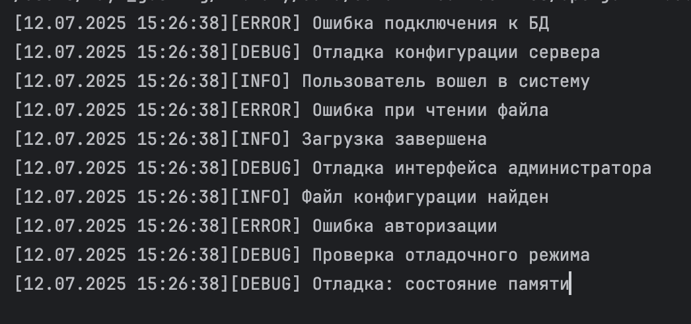
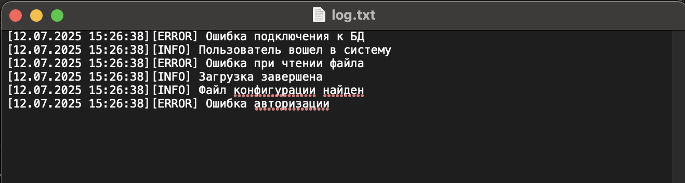

# Задание
Спроектировать и реализовать абстрактный класс для инструмента логгирования Java. 
Сделать разных наследников для данного класса с разными местами для записи лога – в консоль, 
файл. Добавить паттерн «цепочка обязанностей», который строит цепочку логгеров для разных 
ситуаций и используют разные точки вывода (потоки консоли, файлы и пр.).

> Самый простой вариант: цепочка из логгеров debug (в консоль) -> info (в консоль) ->
> info (в файл) -> error (в консоль) -> error (в файл).

---

